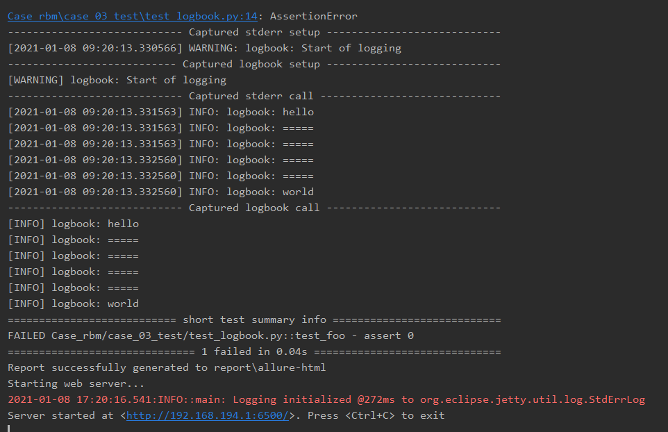
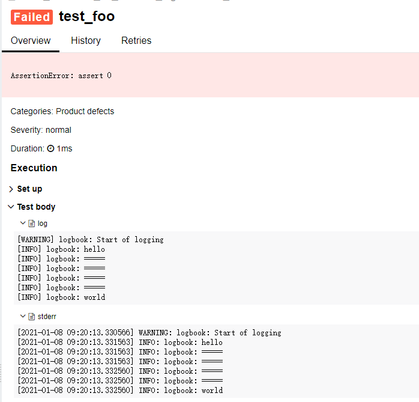
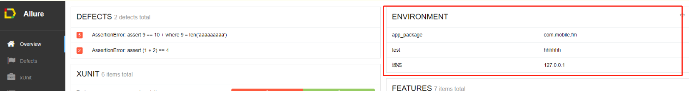

# 一、安装

### 1、安装步骤

```shell
pip install pytest
pip install allure-pytest  # 用于连接pytest和allure
```

安装 `allure `的方法具体可以参照 [allure官方安装说明 ](https://docs.qameta.io/allure/#_installing_a_commandline)

### 2、执行步骤

```shell
pytest --alluredir=report   # 生成json文件
allure generate report      # 将json文件渲染成html文件

# 直接打开上面的html文件会显示loading，需要用allure渲染界面后才能看实际内容
# 前者用于在本地渲染和查看结果，后者用于在本地渲染后对外展示结果。常用open
allure open allure-report   |   allure generate allure-report  
# https://www.pythonf.cn/read/148414
```

### 3、版本兼容性

| Python | Pytest | allure | allure-pytest | pytest-adaptor | 来源                                                      |
| :----: | :----: | :----: | :-----------: | :------------: | --------------------------------------------------------- |
|  3.7   | 6.0.1  | 2.8.0  |    2.8.18     |                |                                                           |
|   3    | 3.2.3  | 2.1.1  |               |     1.7.8      | http://m.blog.chinaunix.net/uid-12014716-id-5828174.html  |
| 3.6.5  | 4.0.2  | 2.7.0  |               |     1.7.0      | https://blog.csdn.net/smilehaoh/article/details/94754467  |
|  3.7   | 5.3.2  | 2.13.3 |    2.8.13     |                | https://blog.csdn.net/galen2016/article/details/105687512 |

> TIPS：如果执行没有报错，说明就是兼容的，如果报告没有结果，可以看看执行pytest --alluredir命令后，指定路径下有没有生成相关的json文件


# 二、配置

### 1、将标准输出同时重定向到控制台和html文件中

> ###### python-pytest日志记录到文件和标准输出
>
> https://www.icode9.com/content-1-524422.html

安装插件：

```shell
pip install pytest-logbook
```

conftest.py：

```python
import logbook
import pytest


@pytest.fixture(scope='module')
def modlog(request):
    """Logger that also writes to a file."""
    name = request.module.__name__
    if name.startswith('test_'):
        name = name[5:]
    logname = 'TEST-' + name + '.log'
    if os.path.exists(logname):
        os.rename(logname, logname + "~")
    logger = logbook.Logger(name)
    logger.handlers.append(logbook.FileHandler(logname, level='DEBUG', bubble=True))
    logger.handlers.append(logbook.StreamHandler(sys.stderr, level='INFO', bubble=True))
    logger.warn("Start of logging")
    return logger
```

test_case.py：

```python
import pytest

def test_foo(modlog):
    modlog.info('hello')
    modlog.info('=====')
    modlog.info('=====')
    modlog.info('=====')
    modlog.info('=====')
    modlog.info('world')
    assert 0
```

结果：





### 2、页面环境定制：

```python
# test_environment.py 文件必须以test_开头命名
# coding=utf-8

import allure

allure.environment(app_package='com.mobile.fm')
allure.environment(test="hhhhhh")
allure.environment(域名="127.0.0.1")
```



