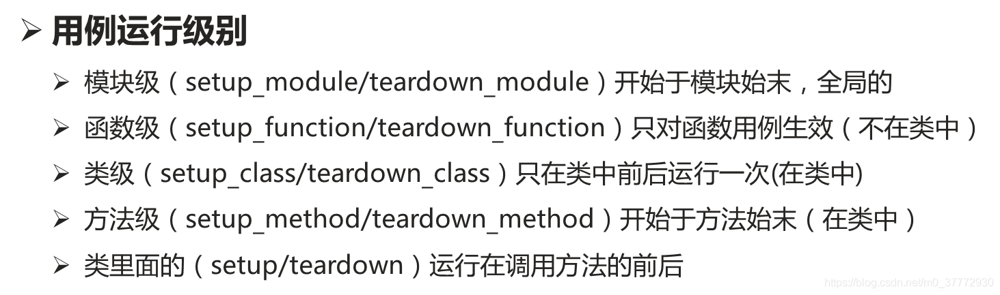

> https://blog.csdn.net/m0_37772930/article/details/105352795

### 一、常用命令

#### 1、命令行常用参数：

* **–help**    查看帮助

* **–collect-only** 展示将要执行的测试用例，而不执行，方便用于常看详细多少用例

* **-k**  通过指定测试用例名称表达式来执行测试用例，关键字执行用例

  ```shell
  # 只运行a测试，不运行b测试
  pytest -k "a and not b"
  ```

* **-m** 用于执行被标记的测试用例，解释器使用

  ```python
  @pytest.mark.others
  def test():
    
  shell> pytest -m others
  ```

* **–junitxml =“ xmlfilename”**   生成XML报告

* **-x**    出现失败测试用例就停止执行。

* **–maxfail=num** 当用例错误个数达到指定数量时，停止测试

* **-s** 允许在测试时输出信息。用户可以从命令行影响输出捕获机制，其中-s选项禁用所有捕获。

* **-v** 输出更详细的信息

* **-q** 简化输出信息

* **-l** 失败的测试用例被堆栈追踪

* **-n NUM：**通过将测试发送到多个CPU，可以加快测试速度。这对于长时间运行的测试或需要大量I / O的测试很有用。这可以导致相当大的加速。

  ```shell
  pytest -n 3 
  ```
  
*  **--count=10**：指定用例执行次数   `pytest --count=3 test_file.py`   也可以在用例方法上加`@pytest.mark.repeat(5)`

> 可以和 `-x` 配合使用，来测试诊断间歇性故障，一遍又一遍的测试，在第一次失败时停止
>
> pytest --count=1000 -x test_file.py


*  **--show-capture=no**   ：禁止对失败用例进行stdout、stderr及日志捕获

  ```shell
  pytest --show-capture=no
  ```
  
* **--capture=sys**：开启对标准输入输出的日志捕获

* **--html=report.html**   输出html格式的测试报告

* **--self-contained-html**   将css融入到html中，便于分享

* **--lf, --last-failed** 只重新运行上次运行失败的用例（或如果没有失败的话会全部跑）

* **--ff, --failed-first** 运行所有测试，但首先运行上次运行失败的测试（这可能会重新测试，从而导致重复的fixture setup/teardown）

- **--nf** 也可以使用 `--new-first` 根据文件插件的时间，新的测试用例会先运行
- **--cache-show=[CACHESHOW]** 显示.pytest_cache文件内容，不会收集用例也不会测试用例，选项参数: glob (默认: '*')
- **--cache-clear** 测试之前先清空.pytest_cache文件

* **--tb=style**  设置报错的时候回溯打印内容，可以设置参数(auto/long/short/line/native/no)

> --tb=auto 有多个用例失败的时候，只打印第一个和最后一个用例的回溯信息
> --tb=long 输出最详细的回溯信息
> --tb=short 输入assert的一行和系统判断内容
> --tb=line 使用一行显示错误信息
> --tb=native 只输出python标准库的回溯信息
> --tb=no 不显示回溯信息

* **–duration=N** 如果N为0，就是统计所有用例的执行时间，如果为3，则是统计运行时间最长的三个用例
* 


#### 2、用例中常用语法：

* assert：也可以打印错误提示

  ```python
  assert a % 2 == 0,"判断a为偶数，当前a的值为：%s"%a
  
  输出结果：
  >       assert a % 2 == 0, "判断a为偶数，当前a的值为：%s"%a
  E       AssertionError: 判断a为偶数，当前a的值为：3
  E       assert (3 % 2) == 0
  ```

  

### 二、各种文件介绍

pytest里面有些文件是非test文件

- **pytest.ini** pytest的主配置文件，可以改变pytest的默认行为
- **conftest.py** 测试用例的一些fixture配置
- **\__init__.py** 识别该文件夹为python的package包
- **tox.ini** 与pytest.ini类似，用tox工具时候才有用
- **setup.cfg** 也是ini格式文件，影响setup.py的行为

ini文件基本格式

```ini
# 保存为pytest.ini文件

[pytest]
# 使用pytest命令时，自动加上的参数
addopts = -s --reruns 1 --html=report.html --self-contained-html

# 预计失败，但是实际上成功了，强制标志为failed
xfail_strict = true  

# 如果mark太多，记不过来，可以在ini文件中打个简单的标签
markers =
  webtest:  Run the webtest case
  hello: Run the hello case
```

*  **.pytest_cache**   pytest 运行完用例之后会生成一个 .pytest_cache 的缓存文件夹，用于记录用例的ids和上一次失败的用例。
  方便我们在运行用例的时候加上--lf 和 --ff 参数，快速运行上一次失败的用例。


### 二、setup和teardown

unittest 的都知道里面用前置和后置 setup 和 teardown 非常好用，在每次用例开始前和结束后都去执行一次。
setupClass 和 teardownClass，需配合@classmethod 装饰器一起使用。
pytest 框架也有类似于 setup 和 teardown 的语法，并且不止这四个。



**运行的优先级**
setup_class>setup_method>setup >用例>teardown> teardown_method>teardown_class


### 三、main函数测试指定用例

```python
if __name__ == '__main__':
    pytest.main(['-s','E://Projects_Py//auto_test_1214//auto_test//Case_rbm//case_01_wq//function.py'])
```


