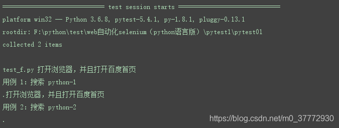
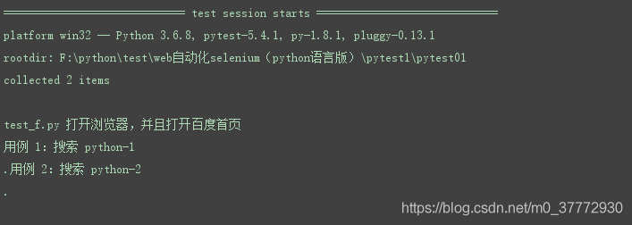
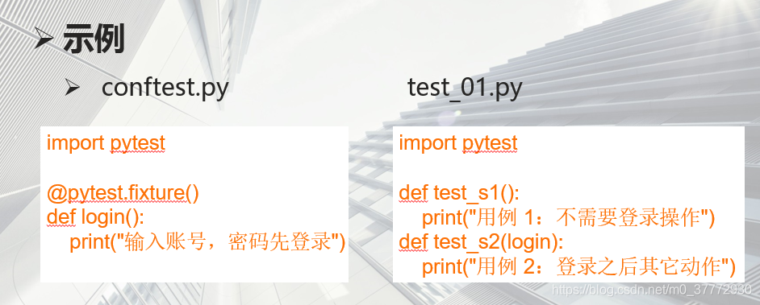
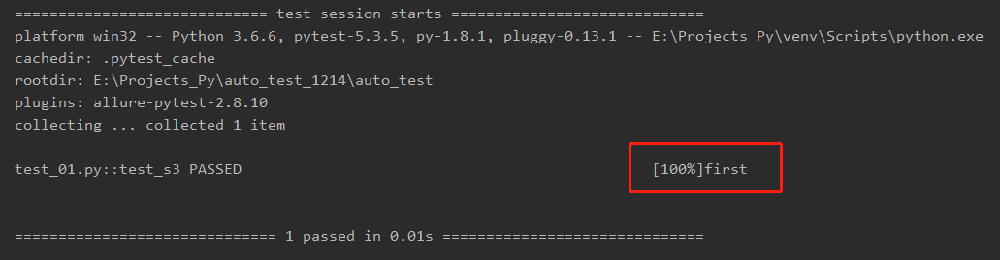
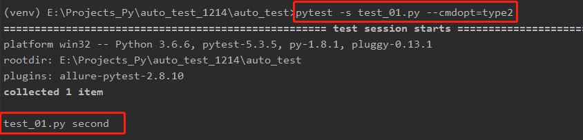

# Fixture

### 介绍：


### 基础参数：

**fixture(scope=“function”, params=None, autouse=False,ids=None, name=None):**
**scope：** 有四个级别参数：function, class、Module（一个py文件）、session（多个py文件）
**params:**  一个可选的参数列表，它将导致多个参数调用fixture 功能和所有测试使用它。
**autouse:**  如果为 True，则为所有测试激活 fixture func 可以看到它。 如果为 False（默认值）则显式需要参考来激活 fixture
**ids:**  每个字符串 id 的列表，每个字符串对应于 params 这样他们就是测试 ID 的一部分。 如果没有提供 ID 它们将从 params 自动生成。
**name:**  fixture 的名称。 这默认为装饰函数的名称

### 用法：

**调用fixture三种方法**

- 1.函数或类里面方法直接传fixture的函数参数名称
- 2.使用装饰器@pytest.mark.usefixtures()修饰
- 3.autouse=True自动使用【@pytest.fixture(autouse=True)】

```python
加了参数autouse=true后，所有用例自动调用该fixture
request.module.__name__   模块名
request.function.__name__ 方法名

@pytest.fixture(scope="function", autouse=True)
def login(request):
    print("模块名为：【%s】，方法名为：【%s】"% (request.module.__name__,request.function.__name__ )
```

### 示例一：基础用法

```bash
import pytest
@pytest.fixture()
def open():
    print("打开浏览器，并且打开百度首页")
def test_s1(open):
    print("用例 1：搜索 python-1")
def test_s2(open):
    print("用例 2：搜索 python-2")
if __name__ == "__main__":
    pytest.main()
```

执行结果如下，fixture里面没有参数的话scope默认是function


```bash
import pytest
@pytest.fixture(scope="module")
def open():
    print("打开浏览器，并且打开百度首页")
def test_s1(open):
    print("用例 1：搜索 python-1")
def test_s2(open):
    print("用例 2：搜索 python-2")
if __name__ == "__main__":
    pytest.main()
```

scope="module"，运行结果如下，open只会执行一次

如果多处需要使用同一个fixture，那么需要配置conftest.py文件

**conftest.py 配置**

* **conftest.py 配置脚本名称是固定的，不能改名称**
* **conftest.py 和运行的用例要在同一个 pakage 下，并且有 `__init__.py`  文件**
* 不需要 import 导入 conftest.py， pytest 用例会自动查
  

### 示例二：cmdopt传入参数

```python
# conftest.py
import pytest

def pytest_addoption(parser):
    parser.addoption(
        '--cmdopt', action='store', default='type1', help='myoption: type1 or type2'
    )

@pytest.fixture()
def cmdopt(request):
    return request.config.getoption('--cmdopt')
```

```python
# test_01.py
import pytest

def test_answer(cmdopt):
    if cmdopt == 'type1':
        print('first')
    elif cmdopt =='type2':
        print('second')
    assert 0

if __name__=='__main__':
    pytest.main()
```



**带参数执行命令：**

```python
# 如果不带参数执行，那么传默认的 default=”type1”，接下来在命令行带上参数去执行
shell> pytest -s test_19_cmd.py --cmdopt=type2
# 命令行传参数有两种写法，迓有一种分成 2 个参数也可以的,参数和名称用空格隔开
shell> pytest -s test_19_cmd.py --cmdopt type2
```

