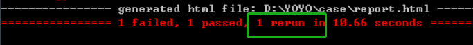

> ###### pytest框架：https://www.cnblogs.com/sundawei7/p/11956618.html#_label3_0
>
> ###### 8 个很棒的 pytest 插件：https://zhuanlan.zhihu.com/p/50317866


在项目的根目录下，我们可以建立一个`pytest.ini`文件，在这个文件中，我们可以实现相关的配置：

```ini
 [pytest]
 addopts = -s -v 
 testpaths = ./scripts
 python_files = test_*.py
 python_classes = Test*
 python_functions = test_*
```

首先，`pytest.ini`文件必须位于项目的根目录，而且也必须叫做`pytest.ini`。

参数介绍：

- `addopts`可以搭配相关的参数，比如`-s`。多个参数以空格分割，其他参数后续用到再说。

  - `-s`，在运行测试脚本时，为了调试或打印一些内容，我们会在代码中加一些print内容，但是在运行pytest时，这些内容不会显示出来。如果带上-s，就可以显示了。
  - `-v`，使输出结果更加详细。

- `testpaths`配置测试用例的目录，

  - 因为我们用例可能分布在不同的目录或文件中，那么这个`scripts`就是我们所有文件或者目录的顶层目录。**其内的子文件或者子目录都要以`test_`开头，pytest才能识别到。**
  - 另外，上面这么写，是从一个总目录下寻找所有的符合条件的文件或者脚本，那么我们想要在这个总目录下执行其中某个具体的脚本文件怎么办？

  ```ini
  [pytest]
  testpaths = ./scripts/
  python_files = test_case_01.py
  ```

  这么写就是执行`scripts`目录下面的`test_case_01.py`这个文件。

- `python_classes`则是说明脚本内的所有用例类名必须是以`Test`开头，当然，你也可以自定义为以`Test_`开头，而类中的用例方法则当然是以`test_`开头。

- `python_functions`则是说脚本内的所有用例函数以`test_`开头才能识别。


#### 1、控制用例执行顺序【pytest-ordering】

```
pip install pytest-ordering
```

```python
@pytest.mark.run(order=3)
def test_case_03(self):
    something
```

手动控制用例执行顺序的方法是在给各用例添加一个装饰器：

```python
@pytest.mark.run(order=x)   # x 是一个整数
```

那么， 现在的执行顺序是`2 1 3`，按照order指定的排序执行的。

如果有人较劲传个0或者负数啥的，那么它们的排序关系应该是这样的：

```
0 > 正数 > 没有参与的用例 > 负数
# 正数和负数就是按照大小关系排列的
```

#### 2、失败重试【pytest-rerunfailures】

```
pip install pytest-rerunfailures
```

需要在`pytest.ini`文件中， 配置：

> [pytest]
> addopts = -s --html=report/report.html **--reruns=3**
> ;addopts = -s --alluredir ./report/result
> testpaths = ./scripts/
> python_files = test_case_01.py
> python_classes = Test*
> python_functions = test_*

给`addopts`字段新增（其他原有保持不变）`--reruns=3`字段，这样如果有用例执行失败，则再次执行，尝试3次。如果第二次就成功了，就不会继续执行第三次。

#### 3、并发执行【pytest-xdist】

```
pip install pytest-xdist
```

需要在`pytest.ini`文件中， 配置：

> [pytest]
> addopts =  -v -s --html=report/report.html **-n=auto**
> ;addopts = -s --alluredir ./report/result
> testpaths = ./scripts/
> python_files = test_case_01.py
> python_classes = Test*
> python_functions = test_*

就是这个`-n=auto`：

- `-n=auto`，自动侦测系统里的CPU数目。
- `-n=numprocesses`，也就是自己指定运行测试用例的进程数。

也可以在命令中使用：

```shell
pytest .\scripts\test_case_01.py -s -n auto
```

#### 4、测试覆盖率【pytest-cov】

```
pip install pytest-cov
```

需要在`pytest.ini`文件中， 配置：

> [pytest]
> addopts =  -v -s --html=report/report.html -n=auto **--cov=./scripts**
> ;addopts = -s --alluredir ./report/result
> testpaths = ./scripts/
> python_files = test_case_01.py
> python_classes = Test*
> python_functions = test_*

也就是配置`--cov=./scripts`，这样，它就会统计所有`scripts`目录下所有符合规则的脚本的测试覆盖率。

执行的话，就照常执行就行。


#### 5、改变pytest外观【pytest-sugar】

[pytest-sugar](https://link.zhihu.com/?target=https%3A//github.com/Frozenball/pytest-sugar) 改变了 `pytest` 的默认外观，添加了一个进度条，并立即显示失败的测试。它不需要配置，只需 `pip install pytest-sugar`，用 `pytest` 运行测试，来享受更漂亮、更有用的输出。

> 试验了一下，发现控制台并无变化，不知道是哪里弄错了


#### 6、失败重试【pytest-rerunfailures】

```shell
pip install pytest-rerunfailures
```

用例失败再重跑1次,命令行加个参数--reruns就行了
```shell
pytest --reruns 1 --html=report.html --self-contained-html
```

> 失败并没有重新运行，理想输出为下：
>
> 


#### 7、断言失败后继续往下执行【pytest-assume】

```
pip install pytest-assume
```

代码如下：

```python
# encoding='utf-8'
import pytest
from pytest_assume.plugin import assume


@pytest.mark.parametrize(('x', 'y'), [(1, 1), (1, 0), (0, 1)])
def test_simple_issume(x, y):
    print("测试数据：x=%s,y=%s" % (x, y))
    # 正常assert 在第一次断言失败就不会执行
    # assert x == y
    # assert x + y > 1
    # assert x > 1

    # pytest.assume 则可以即使失败也执行完所有断言
    # pytest.assume(x == y)
    # pytest.assume(x + y > 1)
    # pytest.assume(x > 1)

    # pytest.assume 的另一种写法如下，这样在原有代码基础上增加就行了，也便于理解
    with assume: assert x == y
    with assume: assert x + y > 1
    with assume: assert x > 1

    print("测试完成！！！")
```

执行结果：

```
collected 3 items
测试数据：x=1,y=1
测试完成！！！

Case_rbm\case_02_wq\test_02.py F
test_simple_issume[1-1] -- filed

----------------------------------------------------------------------------------------------------
测试数据：x=1,y=0
测试完成！！！
F
test_simple_issume[1-0] -- filed

----------------------------------------------------------------------------------------------------
测试数据：x=0,y=1
测试完成！！！
F
test_simple_issume[0-1] -- filed

----------------------------------------------------------------------------------------------------
```

这样还是能够执行到打印【测试完成！！！】

#### 8、用例按照特定顺序执行【pytest-ordering】

```
pip install pytest-ordering
```

代码如下：

```python
class Test_order():

    @pytest.mark.run(order=3)
    def test_01(self):
        print("用例111111111")

    @pytest.mark.run(order=1)
    def test_02(self):
        print("用例2222222222")

    @pytest.mark.run(order=2)
    def test_03(self):
        print("用例3333333333")
```

命令行执行：

```
shell> pytest test_ording.py -vs
```

#### 9、实时查看报错【pytest-instafail】

```
pip install pytest-instafail
```

命令行执行：

```
shell> pytest test_ording.py --instafail --tb=line
```

#### 10、输出html报告【pytest-html】

该插件公开了以下钩子：

- `pytest_html.hooks.**pytest_html_report_title**（*报告*）

  在将**标题**添加到报告之前调用

- `pytest_html.hooks.**pytest_html_results_summary**（*前缀*，*摘要*，*后缀*）

  在将**摘要部分**添加到报告之前调用

- `pytest_html.hooks.**pytest_html_results_table_header**（*单元格*）

  在构建结果表标题之后调用。

- `pytest_html.hooks.**pytest_html_results_table_html**（*报告*，*数据*）

  构建结果表后调用附加HTML。

- `pytest_html.hooks.**pytest_html_results_table_row**（*报告*，*单元格*）

  在构建结果表行之后调用。


