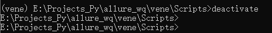
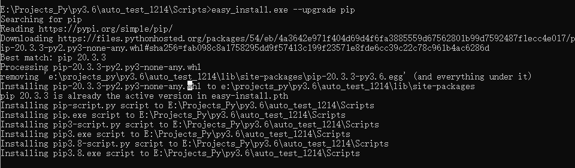
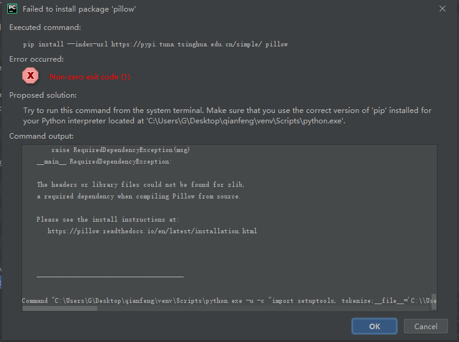
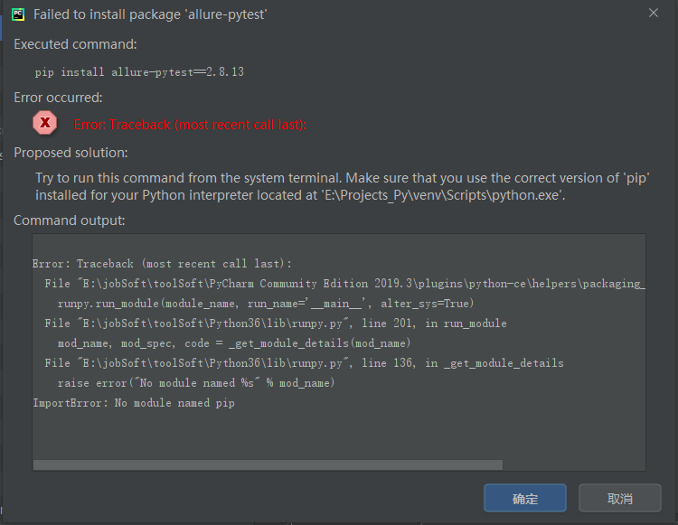
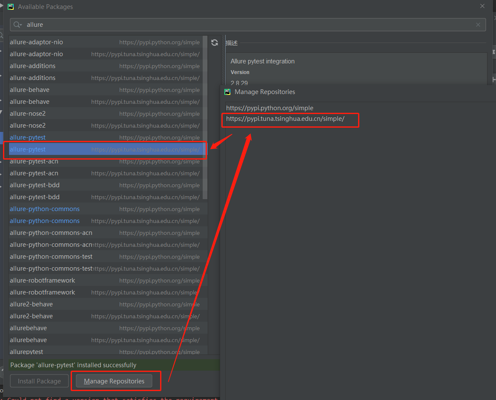

## 一、虚拟环境中的问题

#### 1、创建|进出|迁移 虚拟环境

**1.1 自定义创建虚拟环境**

1. 安装需要版本的python 

2. 指定virtualenv中的python版本 

   ```
   virtualenv --no-site-packages --python=2.7 env
   ```

>  命令解释:
>
> 1. 创建virtualenv虚拟环境之前，系统中必须要安装有对应版本的python，并且卸载之后当前虚拟环境就无效了。系统中可以同时存在python2和python3，通过环境变量中的系统变量path（不是用户变量）控制cmd或者系统中使用哪个版本的python，哪个版本的路径在前面就优先使用哪个版本。
>
> 2. –no-site-packages表示不包括系统全局的Python安装包，这样会更令环境更干净
> 3. –python=python2.7指定Python的版本未系统已经安装了的Python2.7
> 4. env是建立的虚拟环境名称
> 5. 没有安装python2.7或者使用命令virtualenv --no-site-packages --python=python2.7 env会出现The executable python does notexist 错误

**1.2 进入虚拟环境**

**windows:**

```powershell
> cd E:\Projects_Py\allure_wq\vene\Scripts
> activate 
```

**1.3 退出虚拟环境**

**windows：**

```powershell
deactivate
```



1.4 迁移虚拟环境

> 迁移查看链接：https://blog.csdn.net/qq_34146899/article/details/52454616


#### 2、升级pip后，pip使用报错

**【pkg_resources.DistributionNotFound: The 'pip==19.0.3' distribution was not found and is required by】**

```
pip3 -V
报错：pkg_resources.DistributionNotFound: The 'pip==19.0.3' distribution was not found and is required by
```

原因：19.0.3的版本过低，要去虚拟环境中手动升级pip的版本

解决：从虚拟环境的script路径，进入cmd，手动升级pip: `easy_install.exe --upgrade pip`




>  可参考链接：https://blog.csdn.net/qq_40345954/article/details/103870953


## 二、安装第三方库报错【换源】

#### 1、Non-zero exit code(1)



原因：使用的虚拟环境，这个环境中的Python解释器和安装的Python是不一样的，问题所在，这是一个主要是通过一个py模块升级pip的问题，需要进入虚拟环境，升级pip到最新版本

解决：https://www.cnblogs.com/zxkwdw/archive/2004/01/13/12232415.html

#### 2、Error: Traceback (most recent call last):



原因：因为网速太慢了，换个热点或者换个源

解决：

1、换成热点：https://blog.csdn.net/weixin_45825909/article/details/104598584

2、换个第三方源



pycharm自带的源：https://pypi.python.org/simple

改成清华大学的源：https://pypi.tuna.tsinghua.edu.cn/simple/

> pip install --upgrade pip -i https://pypi.tuna.tsinghua.edu.cn/simple/
>
> pip install 某个第三方包 -i https://pypi.tuna.tsinghua.edu.cn/simple/
>
> 豆瓣的源：https://pypi.doubanio.com/simple/
>
> 中科大、上海交大、清华的源，解决下载慢的问题：
>
> https://blog.csdn.net/weixin_45825909/article/details/104598584

