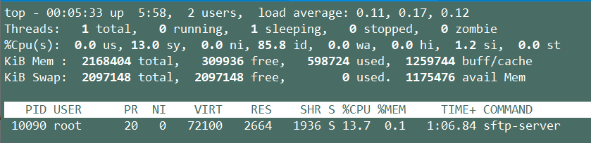

## 路由的增删

#### 设置临时路由

方法一：

```shell
# 查看路由表
route -n

# 添加路由
route add -net 192.168.00/24 gw 192.168.0.1
route add -host 192.168.50.27 gw 192.168.30.47 dev ens9

# 删除路由
route del -net 192.168.00/24 gw 192.168.0.1

# 增加默认路由，默认路由一条就够了
Route add default gw 192.168.0.1

-net 设置到某个网段的路由
-host 设置到某台主机的路由

Gw 出口网关 IP地址
Dev 出口网关 物理设备名
```

方法二：

```shell
# 查看路由表
ip route

# 添加路由
ip route add 192.168.0.0/24 via 192.168.0.1
ip route add 192.168.0.1 dev 192.168.0.1

# 删除路由
ip route del 192.168.0.0/24 via 192.168.0.1

# 增加默认路由，默认路由一条就够了
Ip route add default via 192.168.0.1 dev eth0
# Via 192.168.0.1 是我的默认路由器

Via 网关出口 IP地址
Dev 网关出口 物理设备名
```

#### 设置永久路由

方法一：

没有这个文件的话就手动建一个

```
vim /etc/sysconfig/static-routes

如加入：
route add -net 11.1.1.0 netmask 255.255.255.0 gw 11.1.1.1
则static-routes的格式为
Any net 11.1.1.0 netmask 255.255.255.0 gw 11.1.1.1
```

方法二：

```shell
shell > vim /etc/sysconfig/network-scripts/route-[interface]
10.10.88.163 via 192.168.80.29 dev eno1
10.10.88.165 via 192.168.80.29 dev eno1

shell > systemctl restart network
```

>**win10的添加永久路由：**
>
>route print
>
>route -p add 192.168.80.9 mask 255.255.255.255 10.10.88.29

## 查看和修改MTU值

```shell
# 查看MTU值
cat /sys/class/net/eth0/mtu
# 修改MTU值
echo "1460" > /sys/class/net/eth0/mtu
```

## 查看某个服务的进程，已经线程数量

```shell
shell> ps -e | grep server | awk '{print $1}'
  9452 ?        00:00:00 sftp-server
  9466 ?        00:00:00 sftp-server
  9792 ?        00:00:00 sftp-server

shell> ps -e | grep server | awk '{print $1}'
9452
9466
9792

yum install psmisc -y
```

查看某个进程的线程数

- 方式一：
  cat /proc/[pid]/status
  #展示结果中，Threads后边对应的数字就是进程拥有的线程数量

- 方式二：
  ps hH p [pid] | wc -l

- 方式三：
  top -H -p <pid>




## yum更换阿里的yum源

1、提前安装wget

```
yum -y install wget
```

如果安装失败，就使用curl【默认安装curl】

```
cp /etc/yum.repos.d/CentOS-Base.repo /etc/yum.repos.d/CentOS-Base.repo.bak
curl -o /etc/yum.repos.d/CentOS-Base.repo http://mirrors.aliyun.com/repo/Centos-7.repo
```

2、重新clean并生成缓存

```
yum clean all
yum makecache
```

3、更新系统，把软件更新到最新

```
yum update -y
```

4、安装常用工具包

```
yum install tree wget nmap dos2unix lrzsz nc lsof tcpdump htop iftop iotop sysstat nethogs psmisc net-tools bash-completion vim-enhanced -y
```

