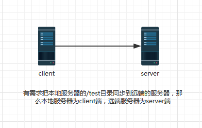
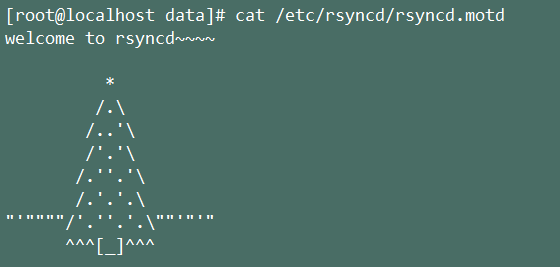
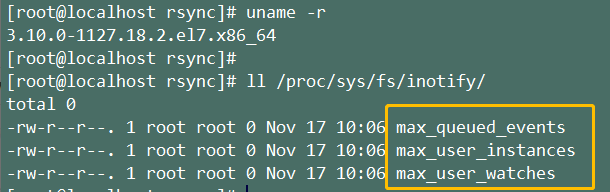

# FTP服务的搭建

## 安装FTP

```
# 安装 
yum install -y vsftpd 

# 设置开机启动 
systemctl enable vsftpd.service 

#启动 
systemctl start vsftpd.service 

#停止 
systemctl stop vsftpd.service 

#查看状态 
systemctl status vsftpd.service
```

## 配置FTP

**备份vsftpd的默认配置文件**

```
cd /etc/vsftpd/ 
cp vsftpd.conf vsftpd.conf.bak
```

### **修改配置vsftpd.conf**

```
#打开配置文件
shell> vim /etc/vsftpd/vsftpd.conf

#显示行号
:set number

#修改配置 12 行
anonymous_enable=NO

#修改配置 33 行
anon_mkdir_write_enable=YES

#修改配置48行
chown_uploads=YES

#修改配置72行
async_abor_enable=YES

#修改配置82行
ascii_upload_enable=YES

#修改配置83行
ascii_download_enable=YES

#修改配置86行
ftpd_banner=Welcome to blah FTP service.

#修改配置100行
chroot_local_user=YES

#添加下列内容到vsftpd.conf末尾
use_localtime=YES
listen_port=21
idle_session_timeout=300
guest_enable=YES
guest_username=vsftpd
user_config_dir=/etc/vsftpd/vconf
data_connection_timeout=1
virtual_use_local_privs=YES
pasv_min_port=40000
pasv_max_port=40010
accept_timeout=5
connect_timeout=1
allow_writeable_chroot=YES
```

### 建立系统用户vsftpd

```
#用户登录终端设为/bin/false(即：使之不能登录系统)
useradd vsftpd -d /data/vsftpd -s /bin/false 
chown -R vsftpd:vsftpd /data/vsftpd
```

### 新建FTP用户

建立用户文件 

```
vim /etc/vsftpd/virtusers 
```

第一行为用户名，第二行为密码。不能使用root作为用户名

```
shell> cat /etc/vsftpd/virtusers 
ftpaAdmin 123456
```

### 生成用户数据文件【用户信息加密，可选】

明文信息既不安全，也不符合让vsftpd服务程序直接加载的格式，因此需要使用db_load命令用哈希（hash）算法将原始的明文信息文件转换成数据库文件，并且降低数据库文件的mod权限（避免其他人看到数据库文件的内容），然后再把原始的明文信息文件删除。

```
db_load -T -t hash-f /etc/vsftpd/virtusers /etc/vsftpd/virtusers.db 
```

#设定PAM验证文件，并指定对虚拟用户数据库文件进行读取 

```
chmod 600 /etc/vsftpd/virtusers.db  
rm -rf virtusers
```

### 修改 /etc/pam.d/vsftpd 文件

修改前先备份 

```
cp /etc/pam.d/vsftpd /etc/pam.d/vsftpd.bak 
vim /etc/pam.d/vsftpd 
```

先将配置文件中原有的 auth 及 account,session的所有配置行均注释掉 

```
auth sufficient /lib64/security/pam_userdb.so db=/etc/vsftpd/virtusers 
account sufficient /lib64/security/pam_userdb.so db=/etc/vsftpd/virtusers 

#session  optional   pam_keyinit.so  force revoke 
#auth    required  pam_listfile.so item=user sense=deny file=/etc/vsftpd/ftpusers onerr=succeed 
#auth    required  pam_shells.so #auth    include   password-auth 
#account  include   password-auth #session  required   pam_loginuid.so 
#session  include   password-auth
```


### 建立虚拟个人目录

建立虚拟用户ftpadmin配置文件 

```
shell> cat /etc/vsftpd/vconf/ftpadmin 

local_root=/data/vsftpd write_enable=YES 
anon_world_readable_only=NO
anon_upload_enable=YES 
anon_mkdir_write_enable=YES 
anon_other_write_enable=YES 
```

建立目录 

```
mkdir /data/vsftpd/
```

### 修改目录属性:

```
chmod -R 775 /data/vsftpd/ 
chown -R vsftpd:vsftpd /data/vsftpd
```

### 文件说明

- rpm -ql vsftpd                  ##查看在安装vftpd软件包时，所产生的配置文件。(这里只做常用的文件)
- /usr/sbin/vsftpd              ##Vsftpd主程序
- /etc/rc.d/init.d/vsftpd    ##用于启动终止脚本
- /etc/vsftpd/vsftpd.conf ##Vsftpd主配置文件
- /etc/pam.d/vsftpd          ##PAM认证文件
- /etc/vsftpd.ftpusers       ##禁止使用Vsftpd的用户列表
- /etc/vsftpd.user_list       ##禁止或允许使用Vsftpd的用户列表
- /var/ftp                            ##匿名用户的下载目录
- /var/ftp/pub                   ##匿名用户默认访问目录
- /etc/logrotate.d/vsftpd.log          ##vsftpd的日志文件

# Rsync

Remote Synchronize ,是Linux默认安装的一个远程数据同步工具，可通过LAN/WAN快速同步多台主机间的文件。

Rsync可以通过rsh或ssh使用，也能以daemon模式去运行。

在以daemon方式运行时Rsync server会打开一个873 端口，等待客户端去连接。连接时，Rsync server会检查口令是否相符，若通过口令查核，则可以开始进行文件传输。第一次连通完成时，会把整份文件传输一次，以后则就只需进行增量备份。

官网： [rsync.samba.org/](https://rsync.samba.org/)

Rsync具有如下特性：

- 支持链接、所有者、组信息以及权限信息的拷贝；
- 通过远程 shell（ssh, rsh）进行传输；
- 无须特殊权限即可安装使用；
- 流水线式文件传输模式，文件传输效率高；
- 支持匿名操作；

Rsync主要分为三个配置文件，分别是：

- rsyncd.conf（主配置文件）
- rsyncd.secrets（密码文件）
- rsyncd.motd（服务器信息文件）

## 环境介绍：

|   主机类型   | 操作系统  |    IP地址    |
| :----------: | :-------: | :----------: |
| rsync 服务端 | centos7.6 | 10.10.88.173 |
| rsync 客户端 | centos7.6 | 10.10.88.174 |

## 安装Rsync

主从服务器都需要安装 Rsync

```
# yum安装rsync
yum install rsync

# 启动rsync
systemctl start rsyncd

# 允许开机自启动
systemctl enable rsyncd

# 检查是否已经成功启动
netstat -lnp |grep 873
```

### **rsync的daemon模式**

**使用daemon模式的时候，一定要分清楚服务端和客户端，与平时理解的服务端与客户端不太一样**

 被同步的一端为服务端，要把文件同步到另一端的源端为客户端

 

## 服务端配置Rsync

**创建rsync管理用户**

```
[root@backup ~]# useradd -s /sbin/nologin -M rsync 
[root@backup ~]# mkdir /data/ 
[root@backup ~]# chown -R rsync.rsync /data/
```

下面演示如何共享/data目录：

新建data目录，和一些测试文件

```
cd /data 
touch test.txt
```

在` /etc/rsyncd.conf `文件中添加下面内容：

```
# 新添加的配置
#设置服务器信息提示文件名称，在该文件中编写提示信息
motd file=/etc/rsyncd/rsyncd.motd

#开启Rsync数据传输日志功能
transfer logging=yes

#设置日志文件名称，可以通过1og format参数设置日志格式
log file=/var/log/rsyncd.1og

#设置Rsync进程号保存文件名称
pid file=/var/run/rsyncd.pid

#设置锁文件名称
lock file=/var/run/rsync.lock

#设置服务器监听的端口号，默认为873
#port=873

#设置服务器所监听网卡接口的IP
#address=10.10.88.173

#设置进行数据传输时所使用的账户名称或ID号，默认使用nobody
uid=rsync

#设置进行数据传输时所使用的组名称或GID号，默认使用nobody
gid=rsync

#设置user chroot为yes后，rsync会首先进行chroot设置，将根映射到path参数路径下，对客户端而言，系统的根就是path参数所指定的路径。但这样做需要root权限，并且在同步符号连接资料时仅会同步名称，而内容将不会同步。
use chroot= false

#是否允许客户端上传数据，这里设置为只读。
read only= false

#设置并发连接数，0代表无限制。超出并发数后，如果依然有客户端连接请求，则将会收到稍后重试的提示消息
max connections=100
fake super = yes

#模块，Rsync通过模块定义同步的目录，模块以[name]的形式定义，这与Samba定义共享目录是一样的效果。在Rsync中也可以定义多个模块

[data]
#comment定义注释说明字串
comment="===========同步说明：模块data============"

#同步目录的真实路径通过path指定
path=/data

#忽略一些IO错误
ignore errors

#exclude可以指定例外的目录，即将common目录下的某个目录设置为不同步数据
#exclude=test/

#设置允许连接服务器的账户，账户可以是系统中不存在的用户
auth users=user1

#设置密码验证文件名称，注意该文件的权限要求为只读，建议权限为600，仅在设置auth users参数后有效
secrets file=/etc/rsyncd.secrets

#设置允许哪些主机可以同步数据，可以是单个IP，也可以是网段，多个IP与网段之间使用空格分隔
hosts allow=10.10.88.174

#设置拒绝所有（除hosts allow定义的主机外）
#hosts deny=*

#客户端请求显示模块列表时，本模块名称是否显示，默认为true
list= true
```

- 欢迎语句：

cat /etc/rsyncd/rsyncd.motd



- 同步文件时登录的账密：

cat /etc/rsyncd.secrets


需要注意的是，密码文件不可以对所有的人开放可读权限，为了安全，建议设置权限为600。

```
chmod 600 /etc/rsyncd.secrets
```

设置完重启服务：

```
shell> systemctl restart rsyncd 
shell> rsync --daemon 
shell> echo “/usr/bin/rsync --daemon” >> /etc/rc.local 
shell> firewall-cmd --permanent --add-port=873/tcp
```

## 客户端配置Rsync

同步命令：

```
rsync -vzrtopg --progress user1@10.10.88.173::data /opt/rsync/
```

上面这个命令需要交互式输入user1用户的密码，下面这个命令可以免交互式，直接从文件中读取密码

```
shell> vim /etc/rsyncd.pwd 123 
# 注意这里只需要输入密码即可 
shell> chmod 600 /etc/rsyncd.pwd 
shell> rsync -vzrtopg --progress user1@10.10.88.173::data /opt/rsync/ --password-file=/etc/rsyncd.pwd
```

**如果需要客户端的文件删除也需要同步，就加个 --delete字段。**

## Rsync常用选项

可以用 rsync --help查看详细命令选项说明。

| 选项                 | 说明                                                         |
| :------------------- | :----------------------------------------------------------- |
| -a, ––archive        | 归档模式，表示以递归方式传输文件，并保持所有文件属性，等价于 -rlptgoD (注意不包括 -H) |
| **-r, ––recursive**  | **对子目录以递归模式处理**                                   |
| -l, ––links          | 保持符号链接文件                                             |
| -H, ––hard-links     | 保持硬链接文件                                               |
| **-p, ––perms**      | **保持文件权限**                                             |
| **-t, ––times**      | **保持文件时间信息**                                         |
| **-g, ––group**      | **保持文件属组信息**                                         |
| **-o, ––owner**      | **保持文件属主信息 (super-user only)**                       |
| -D                   | 保持设备文件和特殊文件 (super-user only)                     |
| **-z, ––compress**   | **在传输文件时进行压缩处理**                                 |
| ––exclude=PATTERN    | 指定排除一个不需要传输的文件匹配模式                         |
| ––exclude-from=FILE  | 从 FILE 中读取排除规则                                       |
| ––include=PATTERN    | 指定需要传输的文件匹配模式                                   |
| ––include-from=FILE  | 从 FILE 中读取包含规则                                       |
| ––copy-unsafe-links  | 拷贝指向SRC路径目录树以外的链接文件                          |
| ––safe-links         | 忽略指向SRC路径目录树以外的链接文件（默认）                  |
| ––existing           | 仅仅更新那些已经存在于接收端的文件，而不备份那些新创建的文件 |
| ––ignore-existing    | 忽略那些已经存在于接收端的文件，仅备份那些新创建的文件       |
| -b, ––backup         | 当有变化时，对目标目录中的旧版文件进行备份                   |
| ––backup-dir=DIR     | 与 -b 结合使用，将备份的文件存到 DIR 目录中                  |
| ––link-dest=DIR      | 当文件未改变时基于 DIR 创建硬链接文件                        |
| ––delete             | 删除那些接收端还有而发送端已经不存在的文件                   |
| ––delete-before      | 接收者在传输之前进行删除操作 (默认)                          |
| ––delete-during      | 接收者在传输过程中进行删除操作                               |
| ––delete-after       | 接收者在传输之后进行删除操作                                 |
| ––delete-excluded    | 在接收方同时删除被排除的文件                                 |
| -e, ––rsh=COMMAND    | 指定替代 rsh 的 shell 程序                                   |
| ––ignore-errors      | 即使出现 I/O 错误也进行删除                                  |
| ––partial            | 保留那些因故没有完全传输的文件，以是加快随后的再次传输       |
| **––progress**       | **在传输时显示传输过程**                                     |
| -P                   | 等价于 ––partial ––progress                                  |
| ––delay-updates      | 将正在更新的文件先保存到一个临时目录（默认为 “.~tmp~”），待传输完毕再更新目标文件 |
| **-v, ––verbose**    | **详细输出模式**                                             |
| -q, ––quiet          | 精简输出模式                                                 |
| -h, ––human-readable | 输出文件大小使用易读的单位（如，K，M等）                     |
| -n, ––dry-run        | 显示哪些文件将被传输                                         |
| ––list-only          | 仅仅列出文件而不进行复制                                     |
| ––rsyncpath=PROGRAM  | 指定远程服务器上的 rsync 命令所在路径                        |
| ––password-file=FILE | 从 FILE 中读取口令，以避免在终端上输入口令，通常在 cron 中连接 rsync 服务器时使用 |
| -4, ––ipv4           | 使用 IPv4                                                    |
| -6, ––ipv6           | 使用 IPv6                                                    |
| ––version            | 打印版本信息                                                 |
| ––help               | 显示帮助信息                                                 |

- 若使用普通用户身份运行 rsync 命令，同步后的文件的属主将改变为这个普通用户身份。

- 若使用超级用户身份运行 rsync 命令，同步后的文件的属主将保持原来的用户身份。

  **常用参数：**

```
-a 包含-rtplgoD 
-r 同步目录时要加上，类似cp时的-r选项 
-v 同步时显示一些信息，让我们知道同步的过程 
-l 保留软连接 
-L 加上该选项后，同步软链接时会把源文件给同步 
-p 保持文件的权限属性 
-o 保持文件的属主 
-g 保持文件的属组 
-D 保持设备文件信息 
-t 保持文件的时间属性 
--delete 删除DEST中SRC没有的文件 
--exclude 过滤指定文件，如--exclude “logs”会把文件名包含logs的文件或者目录过滤掉，不同步 
-P 显示同步过程，比如速率，比-v更加详细 
-u 加上该选项后，如果DEST中的文件比SRC新，则不同步 
-z 传输时压缩
```


## Rsync 优点

rsync具有安全性高、备份迅速、支持增量备份等优点，通过rsync可以解决对实时性要求不高的数据备份需求，例如定期地备份文件服务器数据到远程服务器上，对本地磁盘定期进行数据镜像等。

## Rsync 不足

随着应用系统规模的不断扩大，对数据的安全性和可靠性提出了更高的要求，rsync便暴露出了很多不足之处。首先，rsync同步数据时，需要扫描所有文件后进行比对，然后进行差量传输。如果文件数量达到了百万量级及以上时，扫描文件就非常耗费时间，有时还会出现只是很少一部分数据发生了变化，因此rsync就变得非常低效了。其次，rsync不能够实时监测、同步数据，虽然它可以通过Linux守护进程的方式触发同步，但是两次触发动作一定会出现时间差，可能导致服务器端和客户端的数据出现不一致，后期无法在出现故障时完全恢复数据。

# inotify

上面使用Rsync实现的是手动的文件同步，加上 inotify 可以实现实时的文件同步。

## 介绍

是一种强大的、细颗粒的、异步的文件系统监控机制，内核从2.6.13起，加入Inotify可以监控文件系统中添加、删除、修改移动等各种事件，利用这个内核接口，就可以监控文件系统下文件的各种变化情况。

### 如何实现实时同步

A. 要利用监控服务（inotify），监控同步数据服务器目录中信息的变化

B. 发现目录中数据产生变化，就利用rsync服务推送到备份服务器上

利用脚本进行结合

### 检查内核是否支持inotify

需要2.6.13以后内核版本才能支持inotify软件。2.6.13内核之后版本，在没有安装inotify软件之前，应该有这三个文件。



**三个重要文件说明：**

| max_user_watches   | 8192  | 设置inotifywait或inotifywatch命令可以监视的文件数量（单进程） |
| ------------------ | ----- | ------------------------------------------------------------ |
| max_user_instances | 128   | 设置每个用户可以运行的inotifywait或inotifywatch命令的进程数  |
| max_queued_events  | 16384 | 设置inotify实例事件（event）队列可容纳的事件数量             |

## 安装inotify

只需要在rsync的客户端安装Inotify，因为我们需要监听客户端的文件变更，并上传收到服务端

```shell 
# 安装编译工具 
shell> yum install make gcc gcc-c++             
shell> cd /usr/local/src 
shell> wget http://github.com/downloads/rvoicilas/inotify-tools/inotify-tools-3.14.tar.gz shell> tar zxvf inotify-tools-3.14.tar.gz
shell> cd inotify-tools-3.14 
shell> ./configure --prefix=/usr/local/inotify 
shell> make && make install 

# 检查是否已经成功安装inotify-tools了 
shell> ll -d /usr/local/inotify/ 
drwxr-xr-x 6 root root 4096 Oct 26 12:01 /usr/local/inotify/ 

# 设置系统环境变量
shell> vim /etc/profile ...... export PATH=$PATH:/usr/local/inotify/bin
shell> source /etc/profile
# 添加库文件 
shell> cat /etc/ld.so.conf 
/usr/local/inotify/lib

shell> ldconfig
```


FTP 参考博客：

https://juejin.im/post/6844903998714036237#heading-2

Rsync 参考博客：

https://www.cnblogs.com/opsprobe/p/11809399.html

Rsync+inotify 参考博客：

https://www.cnblogs.com/kevingrace/p/6001252.html

实时增量同步脚本优化：

https://www.cnblogs.com/ginvip/p/6430986.html

windows文件同步可以用File Synchronizer：

https://www.appinn.com/file-synchronizer-for-windows/

