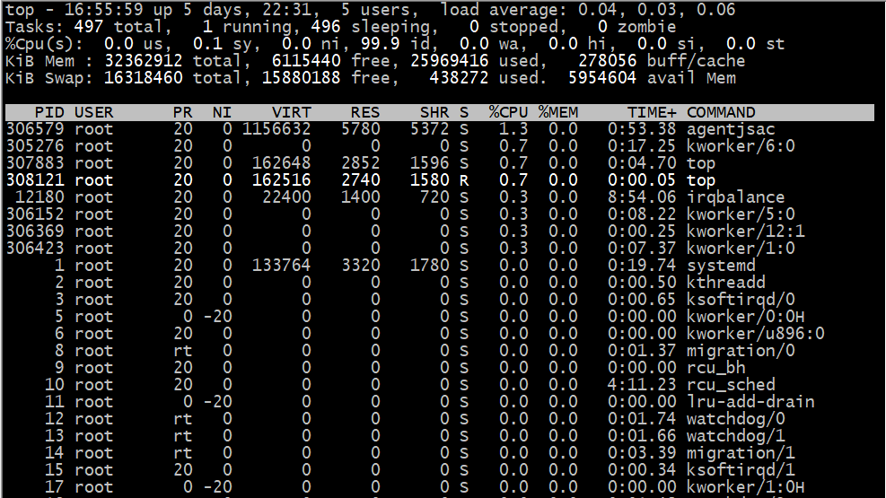
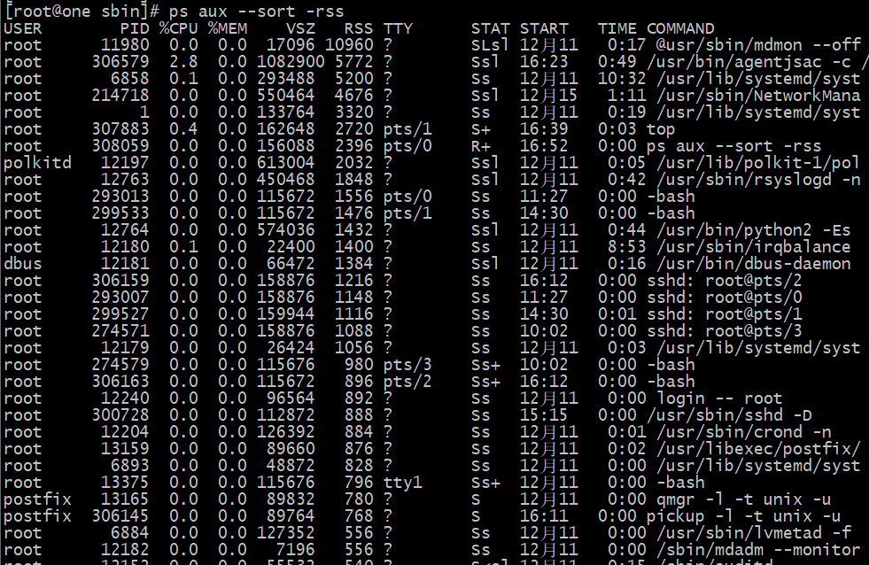
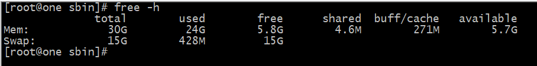
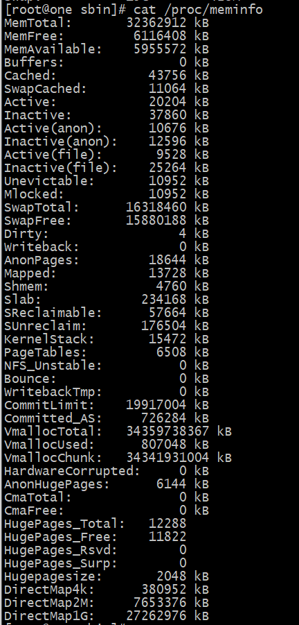

#### 新系统常用工具包：

```shell
yum install tree wget nmap dos2unix lrzsz nc lsof tcpdump htop iftop iotop sysstat nethogs -y
yum install psmisc net-tools bash-completion vim-enhanced -y 
```


#### 修改系统时间，和网络时间同步

```powershell
sudo ntpdate ntp1.aliyun.com
yum -y install ntpdate
ntpdate -d
# no server can be used,exiting
# https://blog.csdn.net/anaitudou/article/details/80931645
```

#### 文件压缩和解压缩

```shell
# 压缩
tar -zcvf webfile.tar.gz webfile
# 解压
tar -zxvf webfile.tar.gz webfile
```

#### 查看内存使用情况

> 1.CPU占用最多的前10个进程：
>
> ps auxw|head -1;ps auxw|sort -rn -k3|head -10
>
> 2.内存消耗最多的前10个进程
>
> ps auxw|head -1;ps auxw|sort -rn -k4|head -10
>
> 3.虚拟内存使用最多的前10个进程
>
> ps auxw|head -1;ps auxw|sort -rn -k5|head -10
>
> 
>
> pmap -x pid  【RSS：占用的物理内存】

**1、top** 

   PID：进程的ID

   USER：进程所有者

​    PR：进程的优先级别，越小越优先被执行

​    NI：进程Nice值，代表这个进程的优先值

​    VIRT：进程占用的虚拟内存

​    RES：进程占用的物理内存

​    SHR：进程使用的共享内存

​    S：进程的状态。S表示休眠，R表示正在运行，Z表示僵死状态

​    %CPU：进程占用CPU的使用

​    %MEM：进程使用的物理内存和总内存的百分

​    TIME+：该进程启动后占用的总的CPU时间，即占用CPU使用时间的累加值

​    COMMAND：启动该进程的命令名称



**2、ps aux --sort -rss**

ps aux ：按照 pid 显示内容 （默认排序方式）

ps aux --sort -rss : 按照 rss 排序显示内容

ps auxw --sort=rss

ps auxw --sort=%cpu



**3、free**

输入命令分类：

free   用KB为单位展示数据

free -m   用MB为单位展示数据

free -h   用GB为单位展示数据



**4、cat /proc/meminfo**



**df -h ：看硬盘占用率**

> #### **万能的** **strace**
>
> http://blog.itpub.net/26736162/viewspace-1704086/


