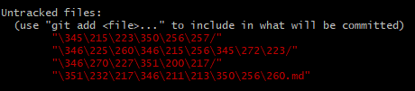

# 常见命令

## clone

**clone** **下来指定的单一分支**

```
git clone -b <branch-name> --single-branch https://github.com/user/repo.git 
```

**clone** **最新一次提交**

只会 clone 最近一次提交，将减少 clone 时间

```
git clone --depth=1 https://github.com/user/repo.git
```


# 常见问题

#### Untracked files



这是git没有把提交的文件加载进来，但是把需要提交的文件都列出来了，只需要用git add XXX(文件名) 把需要提交的文件加上 ，然后git commit -m "xx",再 git  push - u  origin  master重新提交就可以了